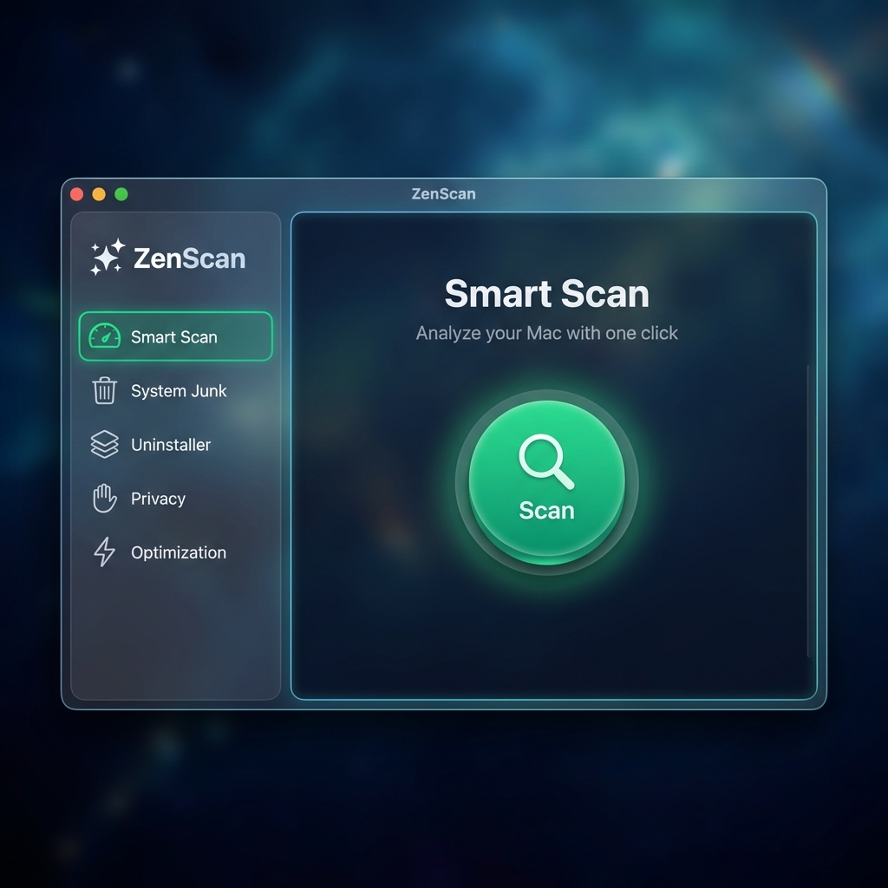

# ZenScan v2.1 - macOS System Maintenance Utility

A high-performance CleanMyMac-style system maintenance utility built with **Swift** and **SwiftUI** for macOS 14+.



## 🆕 What's New in v2.1

### Power Features
- **Disk Space Visualizer** - Interactive treemap visualization
- **RAM Cleaner** - Free inactive memory with one click
- **Secure File Shredder** - Multi-pass DOD 5220.22-M deletion
- **Download Manager** - Clean old downloads by age

### Security & Health
- **Malware Scanner** - Detect adware, PUPs, and threats
- **Battery Health** - Monitor cycle count, capacity, temperature

### UI Polish
- **Keyboard Shortcuts** - Navigate with ⌘1-9
- **15 Modules** in sidebar navigation
- **50 Swift files** (13 new from v2.0)

---

## All Features

| Module | Description |
|--------|-------------|
| Smart Scan | One-click comprehensive analysis |
| System Junk | Clean caches, logs, preferences |
| Large Files | Find files > 50MB-1GB |
| Duplicates | SHA256-based duplicate detection |
| Disk Visualizer | Interactive treemap |
| Downloads | Age-based cleanup |
| Xcode Cleaner | DerivedData, Archives, Simulators |
| Uninstaller | Deep uninstall with containers |
| RAM Cleaner | Free inactive memory |
| File Shredder | Secure multi-pass deletion |
| Malware Scanner | Adware/PUP detection |
| Battery Health | Cycle count, capacity % |
| Privacy | Clear browser data |
| Optimization | Login items, processes |
| Settings | Theme, scheduling, safety |

## Design

| Token | Value | Usage |
|-------|-------|-------|
| Deep Space Blue | `#0B1426` | Backgrounds |
| Frost White | `#F8FAFC` | Text & highlights |
| Emerald Green | `#10B981` | Accents & success |

## Requirements

- macOS 14.0+
- Xcode 15+ (for building)
- Full Disk Access (for scanning protected directories)

## Build

```bash
git clone https://github.com/Anuj-9009/ZenScan.git
cd ZenScan
./build_dmg.sh
```

The DMG will be saved to `~/Downloads/ZenScan.dmg`

## Keyboard Shortcuts

| Key | Action |
|-----|--------|
| ⌘1 | Smart Scan |
| ⌘2 | System Junk |
| ⌘3 | Large Files |
| ⌘4 | Duplicates |
| ⌘5 | Malware Scanner |
| ⌘6 | Uninstaller |
| ⌘7 | Privacy |
| ⌘8 | Optimization |
| ⌘9 | Settings |

## Architecture

```
MVVM with System Agents (50 Swift files)
├── Models (6 files)
├── ViewModels (8 files)
├── Views (19 files)
└── Services/Agents (17 files)
```

## License

MIT License - See [LICENSE](LICENSE) for details.
